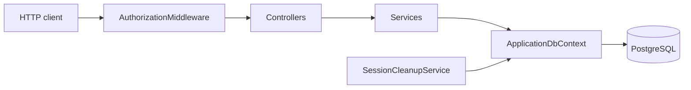
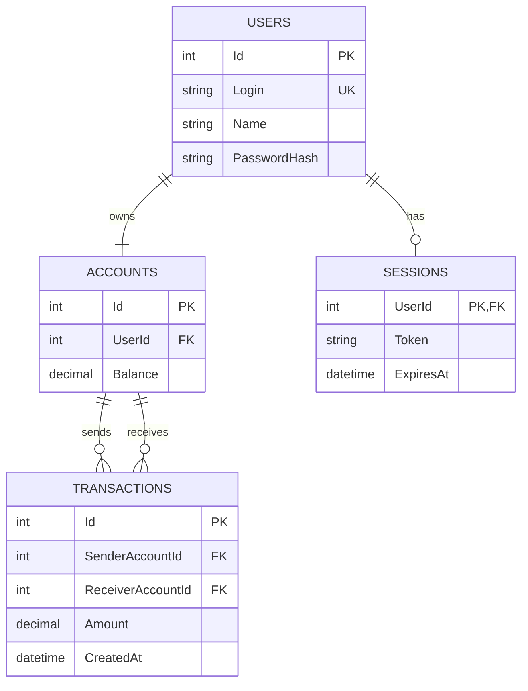

# Nexora

[Русский](README.md) | [English](README.en.md)

Nexora is a REST API for managing users, bank accounts, and financial
operations.

The project is built with ASP.NET Core, Entity Framework Core, and PostgreSQL.

## Features

- user registration and login;
- Bearer token authorization;
- current balance retrieval;
- account deposits;
- transfers between users;
- transaction history with filtering and pagination;
- automatic cleanup of expired sessions every 10 minutes;
- Swagger UI for API exploration and testing.

## Architecture

The application is divided into several layers:



| Component | Responsibility |
|---|---|
| `Controllers` | Receive HTTP requests, perform model binding, and produce HTTP responses |
| `DTOs` | Define API request and response contracts |
| `Services` | Contain user, account, and financial business logic |
| `Models` | Represent database entities |
| `ApplicationDbContext` | Configures tables, relationships, constraints, and seed data |
| `AuthorizationMiddleware` | Validates Bearer tokens and session expiration |
| `SessionCleanupService` | Periodically removes expired sessions |

### Authorized Request Flow

1. The client sends `Authorization: Bearer <token>`.
2. Routing selects an endpoint.
3. `AuthorizationMiddleware` checks for the `[MyAuthorize]` attribute.
4. The middleware loads the session from PostgreSQL and validates `ExpiresAt`.
5. The user identifier is stored in `HttpContext.Items`.
6. The controller passes the `UserId` to a service.
7. The service performs the business operation through `ApplicationDbContext`.

Registration and login endpoints are public. Every `FinanceController` endpoint
is protected by `[MyAuthorize]`.

## Requirements

- .NET SDK 10;
- PostgreSQL;
- the `dotnet-ef` tool.

Check the installed tools:

```powershell
dotnet --version
dotnet ef --version
```

Install `dotnet-ef` if necessary:

```powershell
dotnet tool install --global dotnet-ef
```

## Database Configuration

The application uses the `DefaultConnection` connection string.

For local development, create `Nexora/appsettings.Development.json`:

```json
{
  "ConnectionStrings": {
    "DefaultConnection": "Server=localhost;Port=5433;Database=Nexora;User Id=Nexora;Password=YOUR_PASSWORD;"
  }
}
```

The `appsettings.Development.json` file is excluded by `.gitignore`, so local
credentials are not committed to the repository.

Apply all migrations:

```powershell
dotnet ef database update --project Nexora
```

The migrations create the database tables and add the following seed data:

| Login | Password | Balance |
|---|---|---:|
| `admin` | `password123456` | 1000 |
| `user` | `password` | 2000 |

### Working with Migrations

Create a migration:

```powershell
dotnet ef migrations add MigrationName `
  --project Nexora `
  --output-dir Database/Migrations
```

Apply migrations:

```powershell
dotnet ef database update --project Nexora
```

List migrations and their current state:

```powershell
dotnet ef migrations list --project Nexora
```

Remove the latest migration if it has not been applied:

```powershell
dotnet ef migrations remove --project Nexora
```

Roll the database back to a selected migration:

```powershell
dotnet ef database update PreviousMigration --project Nexora
```

## Running the Application

Restore dependencies and build the project:

```powershell
dotnet restore
dotnet build
```

Run the API:

```powershell
dotnet run --project Nexora
```

Default local addresses:

- HTTPS: `https://localhost:7130`
- HTTP: `http://localhost:5196`
- Swagger UI: `https://localhost:7130/swagger`

If the port is already in use, stop the previous application instance or use
another port:

```powershell
dotnet run --project Nexora --urls "http://localhost:5197"
```

## Authorization

After a successful login, the API returns a token:

```json
{
  "token": "YOUR_TOKEN"
}
```

Protected requests must contain the following header:

```http
Authorization: Bearer YOUR_TOKEN
```

In Swagger UI, click **Authorize** and enter only the token value. Swagger
automatically adds the `Bearer` prefix.

A session is valid for one hour. Expired sessions are automatically removed by
a background service every 10 minutes.

## API Contracts

| Method | Endpoint | Authorization | Input | Success response |
|---|---|---|---|---|
| `POST` | `/api/user/register` | No | JSON: `login`, `name`, `passwordHash` | `200 OK` |
| `POST` | `/api/user/login` | No | JSON: `login`, `passwordHash` | `200 OK` + token |
| `GET` | `/api/finance/balance` | Bearer | None | `200 OK` + balance |
| `POST` | `/api/finance/deposit` | Bearer | JSON: `amount` | `200 OK` |
| `POST` | `/api/finance/transfer` | Bearer | JSON: `receiverLogin`, `amount` | `200 OK` |
| `GET` | `/api/finance/history` | Bearer | Query: `from`, `to`, `offset`, `limit` | `200 OK` + transaction list |

### HTTP Responses

| Status | Purpose |
|---|---|
| `200 OK` | The operation completed successfully |
| `400 Bad Request` | Validation failed or the operation cannot be completed |
| `401 Unauthorized` | The Bearer token is missing, invalid, or expired |
| `404 Not Found` | The user was not found during login |

Business errors use the following response format:

```json
{
  "message": "Error description"
}
```

## API Request Examples

### Registration

```http
POST /api/user/register
Content-Type: application/json

{
  "login": "new-user",
  "name": "New User",
  "passwordHash": "password123"
}
```

PowerShell example:

```powershell
curl.exe -X POST "https://localhost:7130/api/user/register" `
  -H "Content-Type: application/json" `
  -d '{"login":"new-user","name":"New User","passwordHash":"password123"}'
```

### Login

```http
POST /api/user/login
Content-Type: application/json

{
  "login": "admin",
  "passwordHash": "password123456"
}
```

```powershell
curl.exe -X POST "https://localhost:7130/api/user/login" `
  -H "Content-Type: application/json" `
  -d '{"login":"admin","passwordHash":"password123456"}'
```

### Get Balance

```http
GET /api/finance/balance
Authorization: Bearer YOUR_TOKEN
```

```powershell
curl.exe "https://localhost:7130/api/finance/balance" `
  -H "Authorization: Bearer YOUR_TOKEN"
```

Example response:

```json
{
  "balance": 1000
}
```

### Deposit

```http
POST /api/finance/deposit
Authorization: Bearer YOUR_TOKEN
Content-Type: application/json

{
  "amount": 100
}
```

```powershell
curl.exe -X POST "https://localhost:7130/api/finance/deposit" `
  -H "Authorization: Bearer YOUR_TOKEN" `
  -H "Content-Type: application/json" `
  -d '{"amount":100}'
```

### Transfer

```http
POST /api/finance/transfer
Authorization: Bearer YOUR_TOKEN
Content-Type: application/json

{
  "receiverLogin": "user",
  "amount": 50
}
```

```powershell
curl.exe -X POST "https://localhost:7130/api/finance/transfer" `
  -H "Authorization: Bearer YOUR_TOKEN" `
  -H "Content-Type: application/json" `
  -d '{"receiverLogin":"user","amount":50}'
```

### Transaction History

```http
GET /api/finance/history?offset=0&limit=20
Authorization: Bearer YOUR_TOKEN
```

Available query parameters:

| Parameter | Description | Default |
|---|---|---:|
| `from` | Start date in ISO 8601 format | not set |
| `to` | End date in ISO 8601 format | not set |
| `offset` | Number of records to skip | 0 |
| `limit` | Page size from 1 to 100 | 20 |

```powershell
curl.exe "https://localhost:7130/api/finance/history?offset=0&limit=20" `
  -H "Authorization: Bearer YOUR_TOKEN"
```

Example response:

```json
[
  {
    "senderName": "Admin User",
    "receiverName": "Regular User",
    "amount": 50,
    "date": "2026-06-21T12:00:00Z"
  }
]
```

## Database Structure

### `users`

| Column | Type | Description |
|---|---|---|
| `Id` | integer | Primary key |
| `Login` | text | Unique login |
| `Name` | text | User name |
| `PasswordHash` | text | User password data |

### `accounts`

| Column | Type | Description |
|---|---|---|
| `Id` | integer | Primary key |
| `UserId` | integer | Foreign key to `users.Id` |
| `Balance` | numeric(18,2) | Current balance |

### `sessions`

| Column | Type | Description |
|---|---|---|
| `UserId` | integer | Primary and foreign key to `users.Id` |
| `Token` | text | Authorization token |
| `ExpiresAt` | timestamp with time zone | Session expiration time |

Only one active session can be stored for each user.

### `transactions`

| Column | Type | Description |
|---|---|---|
| `Id` | integer | Primary key |
| `SenderAccountId` | integer | Foreign key to the sender account |
| `ReceiverAccountId` | integer | Foreign key to the receiver account |
| `Amount` | numeric(18,2) | Transfer amount |
| `CreatedAt` | timestamp with time zone | Transaction creation time |

## Relationships



## Background Processing

`SessionCleanupService` starts with the application through
`AddHostedService`. Every 10 minutes, the service:

1. creates a dedicated dependency injection scope;
2. resolves a new `ApplicationDbContext` instance;
3. removes sessions where `ExpiresAt < DateTime.UtcNow`;
4. logs the number of deleted sessions;
5. waits for the next execution while observing the cancellation token.

The cleanup uses `ExecuteDeleteAsync`, so expired sessions are removed with one
SQL command without loading entities into application memory.

## Project Structure

```text
Nexora/
├── Attributes/          Custom attributes
├── Controllers/         HTTP endpoints
├── Database/            DbContext and EF Core migrations
│   └── Migrations/
├── DTOs/                Request and response contracts
├── Middlewares/         HTTP pipeline components
├── Models/              Database entities
├── Services/            Business logic and background services
├── Program.cs           DI, Swagger, and HTTP pipeline configuration
└── appsettings.json     Base configuration
```

## Configuration

| Setting | Purpose | Example |
|---|---|---|
| `ConnectionStrings:DefaultConnection` | PostgreSQL connection | `Server=localhost;Port=5433;...` |
| `ASPNETCORE_ENVIRONMENT` | Current application environment | `Development` |
| `applicationUrl` | Local HTTP/HTTPS addresses | `https://localhost:7130` |

In the `Development` environment, the application publishes the OpenAPI
document and Swagger UI.

## Technology Stack

- ASP.NET Core 10
- Entity Framework Core 10
- PostgreSQL
- Npgsql
- Swashbuckle / Swagger UI
