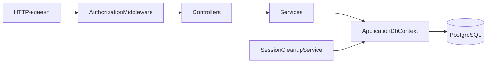
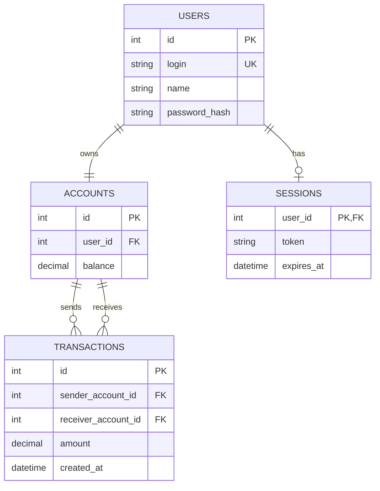

# Nexora

[Русский](README.md) | [English](README.en.md)

Nexora - REST API для управления пользователями, банковскими счетами
и денежными операциями.

Проект реализован на ASP.NET Core с использованием Entity Framework Core
и PostgreSQL.

## Возможности

- регистрация и вход пользователей;
- авторизация через Bearer-токен;
- получение текущего баланса;
- пополнение счета;
- перевод средств другому пользователю;
- просмотр истории операций с фильтрацией и пагинацией;
- автоматическое удаление истекших сессий каждые 10 минут;
- Swagger UI для просмотра и тестирования API.

## Архитектура

Приложение разделено на несколько слоев:



| Компонент | Ответственность |
|---|---|
| `Controllers` | Принимают HTTP-запросы, выполняют model binding и формируют HTTP-ответы |
| `DTOs` | Определяют контракты входных и выходных данных API |
| `Services` | Содержат бизнес-логику пользователей, счетов и финансовых операций |
| `Models` | Представляют сущности базы данных |
| `ApplicationDbContext` | Настраивает таблицы, связи, ограничения и seed-данные |
| `AuthorizationMiddleware` | Проверяет Bearer-токен и срок действия сессии |
| `SessionCleanupService` | Периодически удаляет истекшие сессии |

### Поток авторизованного запроса

1. Клиент отправляет `Authorization: Bearer <token>`.
2. Routing определяет endpoint.
3. `AuthorizationMiddleware` проверяет наличие атрибута `[MyAuthorize]`.
4. Middleware находит сессию в PostgreSQL и проверяет `ExpiresAt`.
5. Идентификатор пользователя сохраняется в `HttpContext.Items`.
6. Контроллер передает `UserId` в сервис.
7. Сервис выполняет бизнес-операцию через `ApplicationDbContext`.

Методы регистрации и входа доступны без токена. Все методы
`FinanceController` защищены атрибутом `[MyAuthorize]`.

## Требования

- .NET SDK 10;
- PostgreSQL;
- установленный инструмент `dotnet-ef`.

Проверить наличие инструментов:

```powershell
dotnet --version
dotnet ef --version
```

Если `dotnet-ef` не установлен:

```powershell
dotnet tool install --global dotnet-ef
```

## Настройка базы данных

Приложение использует строку подключения `DefaultConnection`.

Для локальной разработки рекомендуется создать файл
`Nexora/appsettings.Development.json`:

```json
{
  "ConnectionStrings": {
    "DefaultConnection": "Server=localhost;Port=5433;Database=Nexora;User Id=Nexora;Password=YOUR_PASSWORD;"
  }
}
```

Файл `appsettings.Development.json` добавлен в `.gitignore`, поэтому локальные
учетные данные не попадут в репозиторий.

Применить все миграции:

```powershell
dotnet ef database update --project Nexora
```

Миграции создают таблицы и добавляют тестовые данные:

| Login | Password | Balance |
|---|---|---:|
| `admin` | `password123456` | 1000 |
| `user` | `password` | 2000 |

### Работа с миграциями

Создать новую миграцию:

```powershell
dotnet ef migrations add MigrationName `
  --project Nexora `
  --output-dir Database/Migrations
```

Применить миграции:

```powershell
dotnet ef database update --project Nexora
```

Посмотреть список и состояние миграций:

```powershell
dotnet ef migrations list --project Nexora
```

Удалить последнюю миграцию, если она еще не применена:

```powershell
dotnet ef migrations remove --project Nexora
```

Откатить базу до выбранной миграции:

```powershell
dotnet ef database update PreviousMigration --project Nexora
```

## Запуск

Восстановить зависимости и собрать проект:

```powershell
dotnet restore
dotnet build
```

Запустить API:

```powershell
dotnet run --project Nexora
```

Стандартные адреса при локальном запуске:

- HTTPS: `https://localhost:7130`
- HTTP: `http://localhost:5196`
- Swagger UI: `https://localhost:7130/swagger`

Если порт уже занят, остановите предыдущий экземпляр приложения или укажите
другой порт:

```powershell
dotnet run --project Nexora --urls "http://localhost:5197"
```

## Авторизация

После успешного входа API возвращает токен:

```json
{
  "token": "YOUR_TOKEN"
}
```

Защищенные запросы должны содержать заголовок:

```http
Authorization: Bearer YOUR_TOKEN
```

В Swagger UI нажмите **Authorize** и вставьте только значение токена.
Swagger самостоятельно добавит префикс `Bearer`.

Сессия действует один час. Истекшие сессии автоматически удаляются фоновым
сервисом каждые 10 минут.

## Контракты API

| Метод | Endpoint | Авторизация | Входные данные | Успешный ответ |
|---|---|---|---|---|
| `POST` | `/api/user/register` | Нет | JSON: `login`, `name`, `passwordHash` | `200 OK` |
| `POST` | `/api/user/login` | Нет | JSON: `login`, `passwordHash` | `200 OK` + token |
| `GET` | `/api/finance/balance` | Bearer | Нет | `200 OK` + balance |
| `POST` | `/api/finance/deposit` | Bearer | JSON: `amount` | `200 OK` |
| `POST` | `/api/finance/transfer` | Bearer | JSON: `receiverLogin`, `amount` | `200 OK` |
| `GET` | `/api/finance/history` | Bearer | Query: `from`, `to`, `offset`, `limit` | `200 OK` + список операций |

### HTTP-ответы

| Статус | Назначение |
|---|---|
| `200 OK` | Операция выполнена успешно |
| `400 Bad Request` | Ошибка валидации или выполнение операции невозможно |
| `401 Unauthorized` | Неверные данные для входа либо Bearer-токен отсутствует, недействителен или просрочен |

Ошибки бизнес-логики возвращаются в формате:

```json
{
  "message": "Описание ошибки"
}
```

## Примеры API-запросов

### Регистрация

```http
POST /api/user/register
Content-Type: application/json

{
  "login": "new-user",
  "name": "New User",
  "passwordHash": "password123"
}
```

Пример с `curl`:

```powershell
curl.exe -X POST "https://localhost:7130/api/user/register" `
  -H "Content-Type: application/json" `
  -d '{"login":"new-user","name":"New User","passwordHash":"password123"}'
```

### Вход

```http
POST /api/user/login
Content-Type: application/json

{
  "login": "admin",
  "passwordHash": "password123456"
}
```

```powershell
curl.exe -X POST "https://localhost:7130/api/user/login" `
  -H "Content-Type: application/json" `
  -d '{"login":"admin","passwordHash":"password123456"}'
```

### Получение баланса

```http
GET /api/finance/balance
Authorization: Bearer YOUR_TOKEN
```

```powershell
curl.exe "https://localhost:7130/api/finance/balance" `
  -H "Authorization: Bearer YOUR_TOKEN"
```

Пример ответа:

```json
{
  "balance": 1000
}
```

### Пополнение счета

```http
POST /api/finance/deposit
Authorization: Bearer YOUR_TOKEN
Content-Type: application/json

{
  "amount": 100
}
```

```powershell
curl.exe -X POST "https://localhost:7130/api/finance/deposit" `
  -H "Authorization: Bearer YOUR_TOKEN" `
  -H "Content-Type: application/json" `
  -d '{"amount":100}'
```

### Перевод средств

```http
POST /api/finance/transfer
Authorization: Bearer YOUR_TOKEN
Content-Type: application/json

{
  "receiverLogin": "user",
  "amount": 50
}
```

```powershell
curl.exe -X POST "https://localhost:7130/api/finance/transfer" `
  -H "Authorization: Bearer YOUR_TOKEN" `
  -H "Content-Type: application/json" `
  -d '{"receiverLogin":"user","amount":50}'
```

### История операций

```http
GET /api/finance/history?offset=0&limit=20
Authorization: Bearer YOUR_TOKEN
```

Доступные query-параметры:

| Параметр | Описание | Значение по умолчанию |
|---|---|---:|
| `from` | Начальная дата в формате ISO 8601 | не задано |
| `to` | Конечная дата в формате ISO 8601 | не задано |
| `offset` | Количество пропускаемых записей | 0 |
| `limit` | Размер страницы, от 1 до 100 | 20 |

```powershell
curl.exe "https://localhost:7130/api/finance/history?offset=0&limit=20" `
  -H "Authorization: Bearer YOUR_TOKEN"
```

Пример ответа:

```json
[
  {
    "senderName": "Admin User",
    "receiverName": "Regular User",
    "amount": 50,
    "date": "2026-06-21T12:00:00Z"
  }
]
```

## Структура базы данных

### `users`

| Поле | Тип | Описание |
|---|---|---|
| `id` | integer | Первичный ключ |
| `login` | text | Уникальный логин |
| `name` | text | Имя пользователя |
| `password_hash` | text | Данные пароля пользователя |

### `accounts`

| Поле | Тип | Описание |
|---|---|---|
| `id` | integer | Первичный ключ |
| `user_id` | integer | Внешний ключ на `users.id` |
| `balance` | numeric(18,2) | Текущий баланс |

### `sessions`

| Поле | Тип | Описание |
|---|---|---|
| `user_id` | integer | Первичный и внешний ключ на `users.id` |
| `token` | text | Токен авторизации |
| `expires_at` | timestamp with time zone | Время окончания сессии |

Для одного пользователя хранится не более одной активной сессии.

### `transactions`

| Поле | Тип | Описание |
|---|---|---|
| `id` | integer | Первичный ключ |
| `sender_account_id` | integer | Внешний ключ на счет отправителя |
| `receiver_account_id` | integer | Внешний ключ на счет получателя |
| `amount` | numeric(18,2) | Сумма перевода |
| `created_at` | timestamp with time zone | Время создания операции |

## Связи



## Фоновые процессы

`SessionCleanupService` запускается вместе с приложением через
`AddHostedService`. Каждые 10 минут сервис:

1. создает отдельный dependency injection scope;
2. получает новый экземпляр `ApplicationDbContext`;
3. удаляет сессии, у которых `ExpiresAt < DateTime.UtcNow`;
4. записывает количество удаленных сессий в лог;
5. ожидает следующего запуска с поддержкой `CancellationToken`.

Для удаления используется `ExecuteDeleteAsync`, поэтому истекшие сессии
удаляются одним SQL-запросом без загрузки сущностей в память.

## Структура проекта

```text
Nexora/
├── Attributes/          Пользовательские атрибуты
├── Controllers/         HTTP endpoint-ы
├── Database/            DbContext и миграции EF Core
│   └── Migrations/
├── DTOs/                Контракты запросов и ответов
├── Middlewares/         Компоненты HTTP pipeline
├── Models/              Сущности базы данных
├── Services/            Бизнес-логика и фоновые сервисы
├── Program.cs           DI, Swagger и HTTP pipeline
└── appsettings.json     Основная конфигурация
```

## Конфигурация

| Параметр | Назначение | Пример |
|---|---|---|
| `ConnectionStrings:DefaultConnection` | Подключение к PostgreSQL | `Server=localhost;Port=5433;...` |
| `ASPNETCORE_ENVIRONMENT` | Текущее окружение приложения | `Development` |
| `applicationUrl` | HTTP/HTTPS адреса локального запуска | `https://localhost:7130` |

При окружении `Development` приложение публикует OpenAPI-документ и Swagger UI.

## Основные технологии

- ASP.NET Core 10
- Entity Framework Core 10
- PostgreSQL
- Npgsql
- Swashbuckle / Swagger UI
