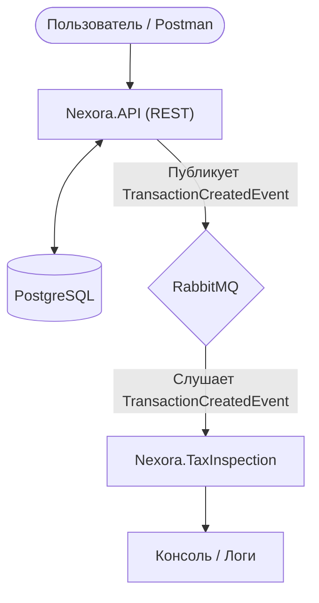

# Nexora

Nexora — это современный финансовый API на базе микросервисной архитектуры, созданный с использованием **ASP.NET Core 10**, **Entity Framework Core**, **PostgreSQL** и **RabbitMQ**. Проект спроектирован по принципам **Чистой Архитектуры (Clean Architecture)** и включает распределённую систему обмена сообщениями для асинхронной обработки финансовых событий.

## Архитектура системы

Проект состоит из двух основных микросервисов, которые общаются через RabbitMQ:

1. **Nexora.API**: Основной REST API, обрабатывающий регистрацию пользователей, аутентификацию, пополнение баланса, переводы и историю транзакций.
2. **Nexora.TaxInspection**: Фоновый сервис (worker), который слушает события транзакций и рассчитывает налог на переводы.


```mermaid
flowchart TD
    User(["Пользователь / Postman"]) --> API["Nexora.API (REST)"]
    API <--> DB[("PostgreSQL")]
    
    API -- "Публикует TransactionCreatedEvent" --> RMQ{"RabbitMQ"}
    RMQ -- "Слушает TransactionCreatedEvent" --> TAX["Nexora.TaxInspection"]
    
    TAX --> Log["Консоль / Логи"]
```

### Слои Чистой Архитектуры (Clean Architecture)

Решение разделено на следующие слои для обеспечения правильного разделения ответственности:

- **Nexora.Domain**: Основные сущности (`User`, `Account`, `Transaction`, `Session`) и доменные события (Domain Events).
- **Nexora.Application**: Бизнес-логика, обработчики CQRS (MediatR), валидация (FluentValidation) и интерфейсы.
- **Nexora.Infrastructure**: Доступ к данным (репозитории EF Core), реализация обмена сообщениями (RabbitMQ Producer) и запросы к БД.
- **Nexora.API**: Контроллеры, Middlewares и HTTP-пайплайн.

## Используемые технологии

- **.NET 10** (C#)
- **ASP.NET Core Web API**
- **Entity Framework Core 10** (Npgsql)
- **PostgreSQL 16**
- **RabbitMQ 3**
- **MediatR** (паттерн CQRS)
- **FluentValidation**
- **AutoMapper**
- **Docker & Docker Compose**

---

## Быстрый старт (Docker)

Самый простой способ запустить всю систему (API, PostgreSQL, RabbitMQ и сервис Tax Inspection) — использовать Docker Compose.

1. Склонируйте репозиторий.
2. Убедитесь, что Docker и Docker Compose установлены и запущены.
3. Выполните следующую команду в корневой директории:

```powershell
docker compose up -d --build
```

Система запустит 4 контейнера:
- `nexora-postgres-1` (Порт: 5434)
- `nexora-rabbitmq-1` (Порты: 5672, 15672)
- `nexora-app-1` (API - Порт: 5196)
- `nexora-tax-inspection-1` (Фоновый консьюмер)

> **Примечание:** Сервисы API и Tax Inspection настроены на ожидание статуса `healthy` от PostgreSQL и RabbitMQ перед запуском. 

### Эндпоинты и доступы

- **Swagger UI**: [http://localhost:5196/swagger](http://localhost:5196/swagger)
- **RabbitMQ Management UI**: [http://localhost:15672](http://localhost:15672) *(логин: guest / пароль: guest)*

---

## API Эндпоинты

### Управление пользователями
| Метод | Эндпоинт | Auth | Тело запроса | Описание |
|---|---|---|---|---|
| `POST` | `/api/user/register` | Нет | `{ "login", "name", "password" }` | Регистрация нового пользователя |
| `POST` | `/api/user/login` | Нет | `{ "login", "password" }` | Авторизация и получение JWT-токена |

### Финансовые операции
| Метод | Эндпоинт | Auth | Тело / Query | Описание |
|---|---|---|---|---|
| `GET` | `/api/finance/balance` | Да | - | Получить текущий баланс |
| `POST` | `/api/finance/deposit` | Да | `{ "amount", "currency" }` | Пополнить баланс |
| `POST` | `/api/finance/transfer` | Да | `{ "receiverLogin", "amount", "currency" }` | Перевести средства другому пользователю |
| `GET` | `/api/finance/history` | Да | `?offset=0&limit=20` | Получить историю транзакций |

*(Аутентификация осуществляется через заголовок `Authorization: Bearer <token>`)*

---

## Пример использования (Workflow)

1. **Регистрация двух пользователей:**
```bash
curl -X POST "http://localhost:5196/api/User/register" -H "Content-Type: application/json" -d "{\"login\":\"user1\", \"name\":\"User One\", \"password\":\"pass123\"}"
curl -X POST "http://localhost:5196/api/User/register" -H "Content-Type: application/json" -d "{\"login\":\"user2\", \"name\":\"User Two\", \"password\":\"pass123\"}"
```

2. **Авторизация (user1):**
```bash
curl -X POST "http://localhost:5196/api/User/login" -H "Content-Type: application/json" -d "{\"login\":\"user1\", \"password\":\"pass123\"}"
# Скопируйте полученный токен
```

3. **Пополнение баланса (user1):**
```bash
curl -X POST "http://localhost:5196/api/Finance/deposit" -H "Authorization: Bearer ВАШ_ТОКЕН" -H "Content-Type: application/json" -d "{\"amount\":1000, \"currency\":\"RUB\"}"
```

4. **Перевод пользователю user2:**
```bash
curl -X POST "http://localhost:5196/api/Finance/transfer" -H "Authorization: Bearer ВАШ_ТОКЕН" -H "Content-Type: application/json" -d "{\"receiverLogin\":\"user2\", \"amount\":150, \"currency\":\"RUB\"}"
```

5. **Проверка логов Tax Inspection:**
```bash
docker compose logs tax-inspection
```
*Вы увидите, что микросервис перехватил событие перевода через RabbitMQ и рассчитал налог!*

---

## Реализованные практики и безопасность

- **Хэширование паролей:** Использование PBKDF2 со случайной солью (salt) и 100 000 итераций.
- **Защита от Timing-атак:** Использование `CryptographicOperations.FixedTimeEquals` для сравнения хэшей.
- **Защита от состояния гонки (Race conditions):** Атомарные изменения баланса через `ExecuteUpdateAsync` в EF Core.
- **Пул соединений:** Использование Singleton `IConnection` для RabbitMQ, предотвращающее утечку TCP-портов.
- **Отказоустойчивость:** Политика переподключения (reconnect) с задержкой 2 секунды для RabbitMQ-консьюмера.
- **Решение проблемы N+1 запросов:** История транзакций использует правильные SQL JOIN-соединения вместо коррелированных подзапросов.
